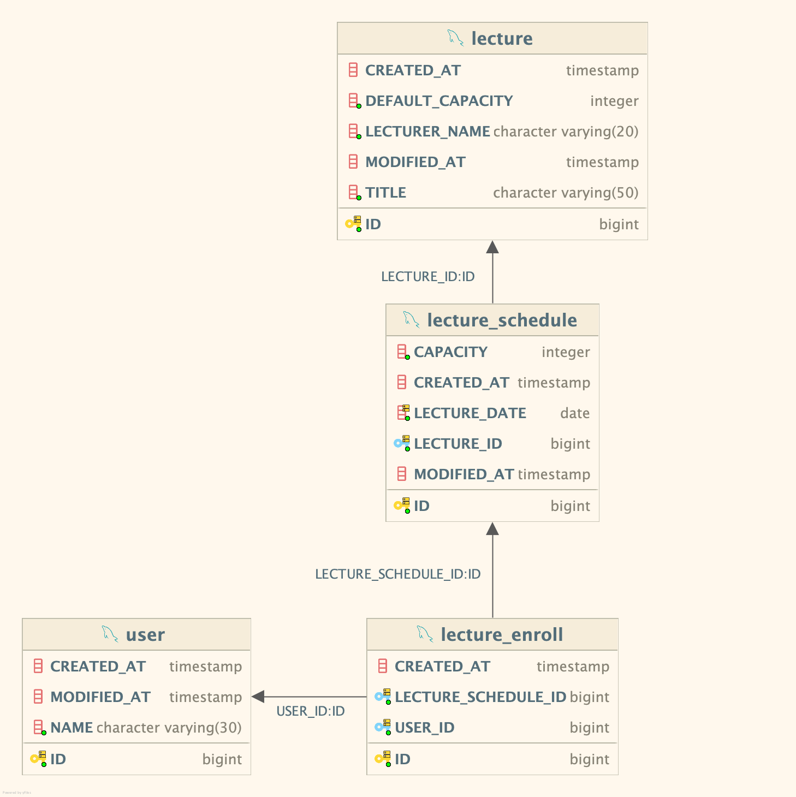

## 개요

이 프로젝트는 강의, 수강 등록, 강의 일정 등을 관리하기 위한 시스템으로, 각 도메인 간의 의존성을 최소화하면서도 필요한 기능을 구현할 수 있도록 설계되었습니다. 주요 목적은 외래키(Foreign Key)를 직접적으로 사용하지 않고, 도메인 간의 결합도를 낮추는 동시에 데이터를 일관되게 관리하는 것입니다. 이는 확장성 있는 시스템을 구축하는 데 중요한 역할을 합니다.

## ERD

위 ERD는 각 테이블 간의 관계를 나타내며, 강의(`Lecture`), 강의 일정(`LectureSchedule`), 수강 등록(`LectureEnroll`), 사용자(`User`) 간의 관계를 설명하고 있습니다. 도메인 간의 결합을 최소화하면서도 필요한 데이터 참조가 가능하도록 설계되었습니다.

## 설계 배경

### 1. 외래키를 사용하지 않음
각 도메인 간의 결합을 느슨하게 하기 위해 외래키를 설정하지 않았습니다. 외래키가 없는 설계는 시스템 간의 의존성을 줄여주고, 특정 도메인 변경 시 다른 도메인에 미치는 영향을 최소화합니다. 또한 도메인 간의 강한 결합을 피하는 것을 중요시 했기 때문에, 데이터베이스에서 외래키를 제거하고 애플리케이션 레벨에서 일관성을 유지하는 방식으로 설계되었습니다.

### 2. `Lecture` Entity
`Lecture` 엔티티는 강의 정보를 관리합니다. 강의의 기본 수강 인원(`defaultCapacity`)은 30명으로 설정되며, 강의 제목(`title`)과 강의자 이름(`lecturerName`)을 필수 값으로 정의하였습니다.

- **목적**: 강의의 기본 정보 관리 및 강의자 이름을 함께 저장.
- **Auditing 기능**: `createdAt`, `modifiedAt` 필드를 통해 생성 및 수정 시각을 자동으로 기록합니다.

### 3. `LectureSchedule` Entity
`LectureSchedule` 엔티티는 강의의 일정과 수강 인원을 관리합니다. 각 강의는 여러 일정이 있을 수 있으며, `lectureId`로 해당 강의를 참조합니다. `capacity` 필드를 통해 해당 강의 일정의 수강 가능 인원을 관리하며, 수강 신청이 있을 때마다 `enroll()` 메서드를 통해 수강 인원을 감소시킵니다.

- **목적**: 강의의 일정 관리 및 수강 가능 인원 관리.
- **Auditing 기능**: 생성 및 수정 시각을 자동 기록합니다.
- **비즈니스 로직**: `enroll()` 메서드를 통해 수강 가능 인원이 남아 있을 때만 등록이 가능하게 합니다.

### 4. `LectureEnroll` Entity
`LectureEnroll` 엔티티는 사용자가 특정 강의에 등록한 내역을 관리합니다. `userId`와 `lectureScheduleId`로 유니크 제약 조건을 설정하여, 한 사용자가 동일한 강의 일정에 중복으로 등록하지 못하도록 하였습니다.

- **목적**: 사용자의 강의 등록 정보 관리.
- **Auditing 기능**: 수강 등록이 생성된 시각을 `createdAt` 필드로 기록합니다.
- **유니크 제약**: `user_id`와 `lecture_schedule_id`의 조합을 유니크하게 유지하여 중복 수강 등록 방지.

### 5. `User` Entity
`User` 엔티티는 사용자의 정보를 관리하며, 강의 시스템 내에서 학생의 역할을 합니다. `name` 필드는 `@PrePersist` 메서드를 통해 ID를 기준으로 자동 생성됩니다. 외래키를 사용하지 않고 ID만으로 다른 엔티티와 연결되도록 설계하여, 사용자 도메인과 다른 도메인 간의 강한 결합을 피했습니다.

- **목적**: 사용자 정보 관리.
- **Auditing 기능**: 생성 및 수정 시각을 자동 기록합니다.
- **비즈니스 로직**: `@PrePersist` 메서드를 통해 이름이 설정되지 않았을 경우, 기본적으로 '수강생 {ID}' 형식으로 이름을 자동 설정합니다.

## 테이블

### `lecture` 테이블
- **설명**: 강의의 기본 정보를 저장하는 테이블입니다. 강의 제목(`title`), 강의자 이름(`lecturerName`), 기본 수강 가능 인원(`defaultCapacity`)을 저장합니다.
- **주요 컬럼**:
    - `id`: 기본 키(PK)로, 각 강의를 고유하게 식별.
    - `title`, `lecturerName`: 검색 성능을 향상시키기 위해 길이를 제한하고 인덱스를 고려할 수 있음.
    - `defaultCapacity`: 기본 수강 가능 인원을 지정하여 수강 신청 시스템에서 이를 활용.
- **인덱스**: `id`(PK)에 기본적으로 인덱스가 설정되어 있으며, `lecturerName`과 같은 컬럼에 추가적인 인덱스를 적용할 수 있음.

### `lecture_schedule` 테이블
- **설명**: 강의의 일정과 해당 일정의 수강 인원을 관리합니다.
- **주요 컬럼**:
    - `id`: 기본 키(PK)로, 각 강의 일정을 고유하게 식별.
    - `lectureId`: 강의(`Lecture`)와의 관계를 나타내는 외부 키(FK) 역할을 합니다.
    - `lectureDate`: 해당 강의 일정의 날짜를 저장합니다.
    - `capacity`: 해당 일정의 남은 수강 가능 인원. 수강 신청 시 이 값을 감소시키는 방식으로 수강 인원을 관리합니다.
- **인덱스**: `lectureId`와 `lectureDate`에 대해 복합 인덱스를 설정하여 일정 검색을 빠르게 처리.
- **추가사항**: 일정(`lectureDate`)에 대한 검색이 빈번하게 이루어질 가능성이 있으므로, `lectureId`와 함께 복합 인덱스를 설정해 검색 성능을 최적화했습니다. 또한, 수강 인원 관리(`capacity`)는 트랜잭션 처리의 중요한 부분이므로 동시성 문제를 방지하기 위한 잠금 메커니즘(Locking Mechanism) 또는 트랜잭션 격리 수준을 설정하는 것이 중요합니다.

### `lecture_enroll` 테이블
- **설명**: 사용자의 강의 등록 내역을 저장하는 테이블입니다. 각 사용자가 특정 강의 일정에 대해 등록 여부를 관리합니다.
- **주요 컬럼**:
    - `id`: 기본 키(PK)로, 각 등록 내역을 고유하게 식별.
    - `userId`: 사용자(`User`)와의 관계를 나타냅니다.
    - `lectureScheduleId`: 강의 일정(`LectureSchedule`)과의 관계를 나타냅니다.
- **인덱스**: `userId`와 `lectureScheduleId`에 대해 유니크 제약 조건 및 인덱스 설정.
- **추가사항**: 수강 등록은 동시성 문제가 발생할 수 있는 영역이므로, 트랜잭션 관리와 동시에 빠른 검색을 위한 인덱스 설계가 중요합니다. 유니크 제약 조건을 설정하여 동일한 사용자가 같은 강의 일정에 중복으로 등록하지 않도록 관리합니다.

### `user` 테이블
- **설명**: 사용자 정보를 저장하는 테이블입니다. 사용자 ID와 이름을 관리합니다.
- **주요 컬럼**:
    - `id`: 기본 키(PK)로, 각 사용자를 고유하게 식별.
    - `name`: 사용자의 이름. `@PrePersist` 메서드를 통해 자동으로 생성될 수 있습니다.
- **인덱스**: `id`(PK)에 기본적으로 인덱스가 설정되어 있으며, `name`은 빈번한 검색 대상이 아닐 수 있어 추가 인덱스가 필요하지 않을 수 있습니다.
- **추가사항**: 사용자 정보는 수강 등록 시 참조되므로, 사용자 수가 늘어남에 따라 적절한 캐싱이나 데이터 파티셔닝을 고려할 수 있습니다. 또한, ID 기반으로 다른 테이블과의 연관관계를 관리하므로 ID 값의 유효성 검증과 고유성 관리가 중요합니다.

## 인덱스 및 성능 고려 사항
- **인덱스 설정**: 주요 검색 대상인 `lectureId`, `lectureDate`, `userId`, `lectureScheduleId`에 적절한 인덱스를 설정하여 쿼리 성능을 최적화하였습니다.
- **트랜잭션 처리**: 수강 신청과 같은 동시성 이슈가 발생할 수 있는 기능에 대해 적절한 트랜잭션 격리 수준을 설정하여 데이터 무결성을 보장합니다.
